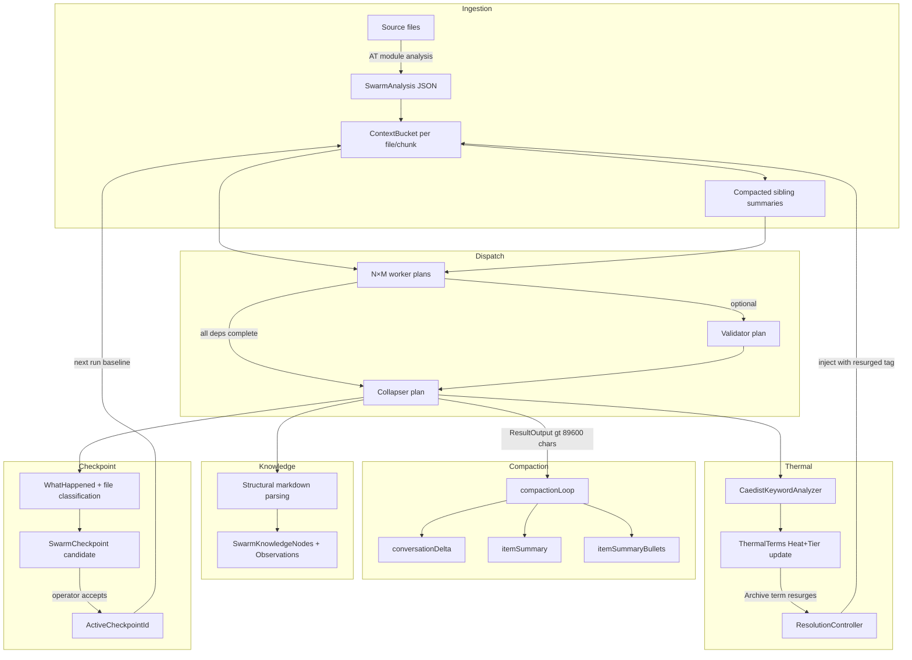
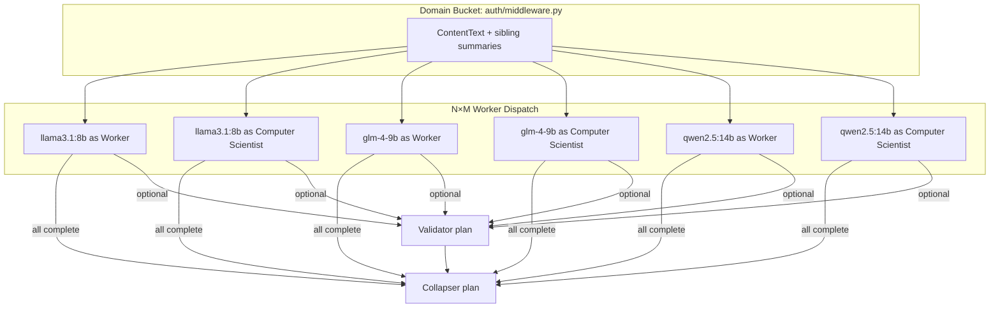
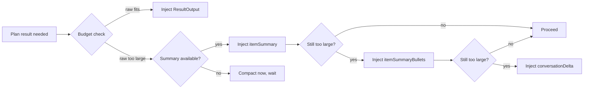
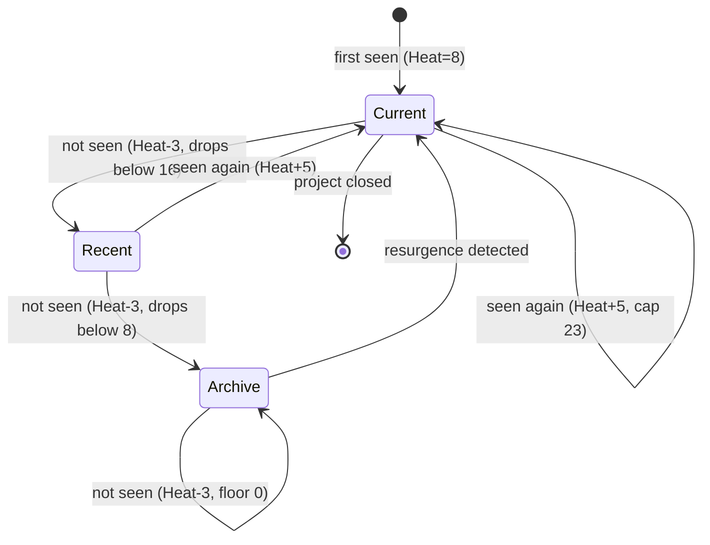
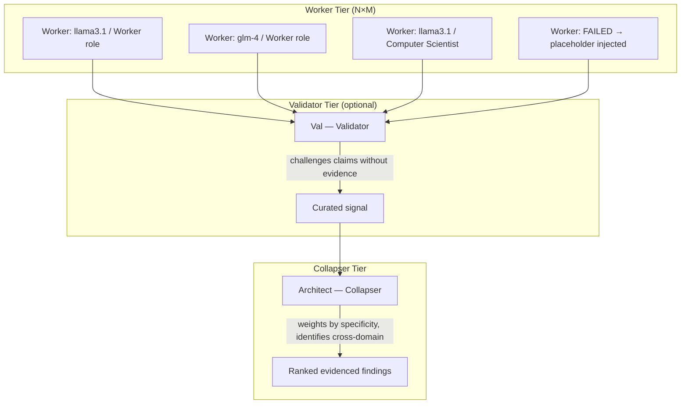
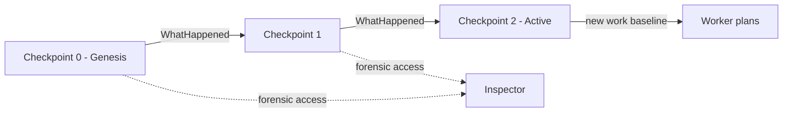
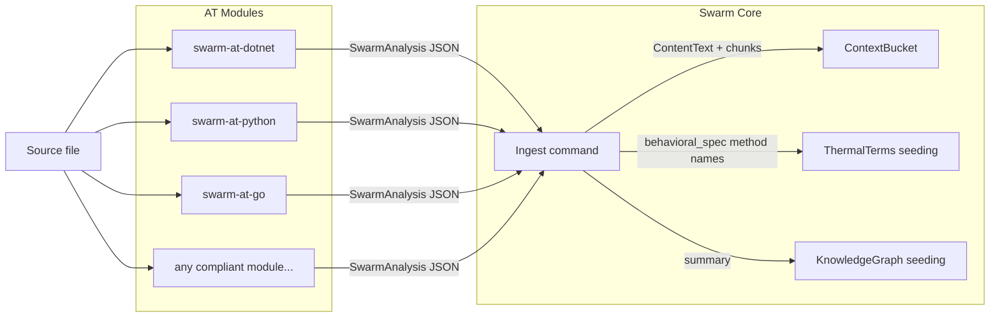
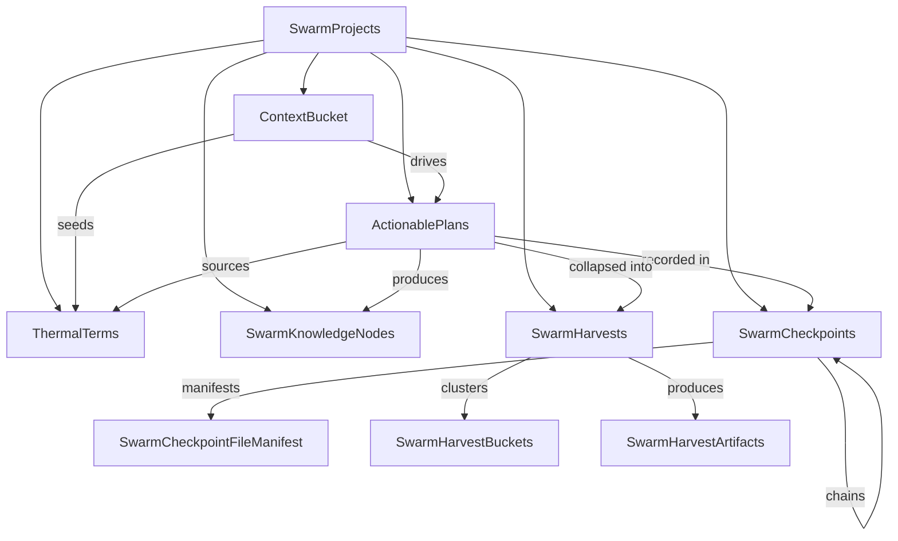

# ARCHITECTURE.md
# Swarm — Context Lifecycle, Thermal Model, Collapser Pattern, Checkpoint System

**Repository**: [github.com/itischriso/Caedist-Swarm-Engine](https://github.com/itischriso/Caedist-Swarm-Engine)  
**Version**: 1.0.0

---

## The Problem This Solves

Every approach to using LLMs for large-scale analysis hits the same wall: context.

A modern LLM has a large context window — but "large" is relative when a codebase spans
hundreds of files, a corpus spans thousands of documents, or an analysis needs to run for
sixteen hours. Beyond raw size, there is a more insidious problem: **context degrades**.
Content that matters in hour two becomes invisible by hour eight. The model cannot hold
the whole thing. And if you try to keep everything in the window, you get the
"lost in the middle" effect — reasoning quality drops sharply for content that isn't
near the beginning or end of a very large context.

The standard responses to this problem are:
- **RAG** — retrieve relevant chunks and hope you retrieved the right ones
- **Chunking** — split into pieces and process independently, losing cross-domain signal
- **Bigger models** — wait for the next generation window size
- **Agent loops** — let the model decide what to read next, creating self-selected reality

None of these are satisfying. RAG retrieves what it thinks is relevant, not what actually
is. Chunking loses coherence. Bigger windows still degrade. Agent loops accumulate noise
and eventually lose track of the problem they were solving.

Swarm is a different approach: a **context lifecycle management system** built around the
principle that context is never lost — it is archived, thermally tracked, and
deterministically resurrected when evidence of relevance reappears.

---

## Core Principles

**Model diversity over monoculture (BYOM).** The system is designed for heterogeneous
model pools. A team of different models does not share the same blind spots or amplify
the same biases. The Validator running on a different model than the workers is more
likely to catch what the workers missed.

**Leveraging disagreement.** Disagreements between workers are signal, not error.
The Collapser does not resolve disagreement by averaging or deferring to the majority
— it follows the evidence. A finding with a file name, method name, and line number
outweighs a finding that says "the code does X."

**Horizontal context scaling.** Context scales with workers, not with window size.
A 500-file codebase does not require a 500-file context window. It requires 500 workers
each holding one file at full depth, with compacted awareness of the rest.

**Orchestrator-owned context.** LLMs do not decide what context they need. A
deterministic, non-LLM orchestrator assembles every prompt from a defined set of inputs.
This prevents the context drift and self-selected reality that defeat conventional
multi-agent approaches.

**Resilience and asynchronicity.** The system runs on consumer hardware. All state is
persisted to SQLite. A sixteen-hour run survives a power cycle and resumes from exactly
where it stopped. LLM workers do not need to exist concurrently.

**Coordinates over guesswork.** Once the system has a file hash, method name, line
anchor, or thermal term, it uses that coordinate deterministically to locate context.
LLMs are computationally expensive and non-deterministic; coordinates are cheap and
precise.

---

## The Context Lifecycle

This is the main flow. Every mechanism in Swarm exists to serve this lifecycle.



---

## Domain Allocation and N×M Dispatch

**The failure mode this prevents:** Chunking produces isolated fragments. Each fragment
is analysed in isolation with no awareness that the rest of the file exists. The worker
assigned to method A has no idea what method B does, even if they interact directly.

**The Swarm solution:** Domain allocation with compacted sibling awareness.

The corpus is divided into domains — files, or chunks within large files when AT module
analysis detects semantic boundaries. Each worker is assigned one domain as its primary
responsibility and receives the full, raw content of that domain. It also receives
**compacted summaries** of every other domain — enough to know that siblings exist and
what they broadly contain, without being overwhelmed by their detail.

Every worker has depth in one place and breadth awareness everywhere else. This is not
chunking. It is **domain ownership**.

### N×M Dispatch

Swarm dispatches **N models × M roles** per domain bucket. You select N models from your
provider pool and M roles (personas) from your configuration. Each combination produces
an independent worker plan against the same domain content. A domain analysed by 3 models
and 3 roles produces 9 independent analyses before the Collapser synthesises.



The diversity of the worker pool is itself a quality mechanism. Different models have
different failure modes and different blind spots. A finding that six independent
model/role combinations all cite with specific evidence is stronger than any single
worker's assertion.

This is the **BYOM** (Bring Your Own Model) principle: Swarm does not prescribe models.
It prescribes the dispatch pattern. Your pool determines the quality ceiling.

---

## Compaction and Resolution Stepping

**The failure mode this prevents:** A 16-hour analysis run produces hundreds of plan
outputs. If every downstream plan tries to use raw output as context, it immediately
exceeds the context window. Naive truncation loses the signal at exactly the wrong
moment.

**The Swarm solution:** Three-representation compaction with token-aware resolution
stepping.

When a completed plan's `ResultOutput` exceeds the compaction threshold (89,600 chars,
≈28k tokens at 3.2 chars/token), a background daemon streams it to a model and generates
three compressed representations stored on the same `ActionablePlans` row:

| Representation | Field | Purpose |
|----------------|-------|---------|
| Full raw output | `ResultOutput` | Complete evidence; first choice when budget allows |
| Prose summary | `itemSummary` | Condensed paragraph; second choice |
| Bullet summary | `itemSummaryBullets` | Key findings only; third choice |
| Delta | `conversationDelta` | What changed since prior checkpoint; last resort |

The orchestrator applies **token-aware resolution stepping** when assembling context for
downstream plans: it tries raw first, steps to summary if the budget is exceeded, then
to bullets, then to delta. The model always receives the highest-resolution representation
that fits.



---

## Thermal Tracking and the ResolutionController

**The failure mode this prevents:** A term — a method name, an architectural concept, a
security finding — is central to the analysis in hour two. By hour eight, after hundreds
of intervening plans, it has dropped out of active context. Future workers cannot connect
new findings to the earlier work. The analysis fragments.

**The Swarm solution:** Thermal tracking with deterministic resurrection.

After every plan completes, `CaedistKeywordAnalyzer` extracts **thermal terms** from the
output text: CamelCase identifiers, snake\_case names, and backtick-quoted identifiers.
Each term has a Heat value and a Tier.

### Heat Model

| Event | Heat delta | Cap |
|-------|-----------|-----|
| New term seen | +8 (initial) | — |
| Term seen again | +5 | 23 |
| Term not seen | -3 | 0 |

### Tier Derivation

Tier is computed from Heat on every update — it is not stored independently:

```
Heat ≥ 16  →  Current  (Tier 2)
Heat ≥ 8   →  Recent   (Tier 1)
Heat < 8   →  Archive  (Tier 0)
```



### The ResolutionController

A background daemon monitors `ThermalTerms` for **Archive → Current transitions** —
terms that were cold and have suddenly reappeared in plan outputs. When a resurgence is
detected:

1. The ResolutionController locates the historical plan where the term was last active
2. It extracts the compacted summary (`itemSummary` or `itemSummaryBullets`) from that plan
3. It rehydrates that summary into the active context bucket with a `(resurged)` tag

The term came back because it became relevant again. The system brings its history with it.
**Nothing is forgotten. Things become archived. They resurface when evidence demands it.**

---

## Orchestrator-Owned Context Selection

**The failure mode this prevents:** In most agentic frameworks, the model decides what
context it needs. It queries a retrieval system, decides what to read next, self-selects
its own reality. This creates echo chambers: models retrieve the context that confirms
their current (possibly wrong) direction. The feedback loop compounds over time.

**The Swarm solution:** The Orchestrator owns context selection deterministically.

The Orchestrator is not an LLM. It cannot be manipulated, it does not have a direction
to confirm. For every plan it assembles, the context is compiled from:

- `ProjectId` — isolation boundary
- `SwarmProjects.ActiveCheckpointId` — the active baseline
- The accepted checkpoint manifest — known file states
- Project-scoped global context — shared across all workers
- Explicit dependency plan IDs — prior Collapser outputs
- Thermal dictionaries and resolution tiers — what is hot, recent, or archived
- Explicit operator input — the question or objective

Models receive what the Orchestrator decides they should receive. They do not ask for
more. Model outputs may update evidence, summaries, deltas, and thermal signals after
execution — but they do not control the active context pool.

---

## The Collapser Pattern: Worker → Validator → Collapser

**The failure mode this prevents:** Without a synthesis step, the Swarm produces N
opinions with no resolution. With a naive synthesis step, a single weak worker's output
dilutes the collective finding. With a sycophantic Validator, false confidence propagates
to the Collapser and corrupts the output.

**The Swarm solution:** A three-tier quality gate.



### The Worker

Workers are the primary analysis units. Each worker receives:
- Raw content of its assigned domain bucket
- Compacted summaries of sibling domains
- The shared global context
- The objective

Workers are rigorous by design (see Val below for why this matters). They cite
specifically. They do not describe what a file is supposed to do — they describe what it
actually does. If there is a gap, they name it.

A permanently failed worker (after 3 retries) does not abort the run. The orchestrator
injects a `FAILED` placeholder into the Collapser's input. A failed worker is noise
removed, not a reason to stop.

### The Validator (Val)

Val is the quality gate before the Collapser. Val's mandate is minimal and precise:
challenge every claim, call out what is wrong, demand evidence. "Show me."

Val does not rubber-stamp. A Validator who rubber-stamps is worse than no Validator —
it gives false confidence to the Collapser and corrupts the collective output.

Val is model-sensitive by design. The same short prompt produces different output
quality depending on the model's RLHF disposition. A model trained toward agreeableness
produces mild pushback. A more combative model produces genuine adversarial review.
This is the BYOM principle at the persona level: Swarm prescribes the disposition,
you supply the model that carries it.

### The Collapser

The Collapser synthesises across all worker (and Validator) outputs. It does not
summarise or average. It:

- Identifies what the collective evidence **proves** — findings with multiple independent
  citations are stronger than single-worker findings
- Weights by specificity — a citation with file, method, and line outweighs an assertion
- Identifies cross-domain findings — patterns no single worker could see alone
- Explicitly flags what the evidence is insufficient to conclude

The Collapser is the last quality gate before the human.

---

## Checkpoints: Rollover, Not Replacement

**The failure mode this prevents:** After a long analysis run, a naive "summarise and
restart" approach discards the evidence that makes findings trustworthy. Future plans
cannot verify against the raw source. The audit trail is broken.

**The Swarm solution:** Checkpoint-as-rollover with forensic preservation.

A Swarm checkpoint is not a summary that replaces prior context. It is a **rollover**:

- Prior context is preserved at full resolution in the database
- The checkpoint becomes the new active baseline
- The baseline is computed from the prior checkpoint plus `WhatHappened`

`WhatHappened` is the bridge between checkpoints. It is produced by comparing the current
filesystem/database state to the previous manifest and classifying every known file:

| Classification | Meaning |
|---------------|---------|
| Unchanged | Hash matches prior manifest |
| Modified | Hash differs from prior manifest |
| New | Not present in prior manifest |
| Missing | Was in prior manifest, not found now |
| Deprecated | Explicitly marked for retirement |
| Unknown | Insufficient evidence to classify |

Checkpoints are **candidate** until an operator accepts them. Once accepted, the project's
`ActiveCheckpointId` advances. Prior checkpoints remain accessible for forensic inspection
at any resolution — raw output, summary, bullets, or delta.



A checkpoint chain is traversable at any generation. Nothing is discarded; resolution
is reduced only when the token budget requires it.

---

## Knowledge Graph: Opportunistic Extraction

After every plan completes, the Swarm parses the output for structured markdown —
headings, bullet points, numbered lists — and constructs a knowledge graph without
requiring an additional LLM call.

Extracted entities become `SwarmKnowledgeNodes`. Evidence records become
`SwarmKnowledgeObservations`. Responder-level confidence accumulates in
`SwarmResponderKnowsAbout`.

Only relationships with confidence ≥ 0.75 are surfaced in the UI. Weak links are tracked
but not amplified.

The knowledge graph serves two purposes:
1. **Immediate**: a queryable map of concepts, components, and relationships extracted
   from the run
2. **Thermal seeding**: method names and identifiers in the graph become initial thermal
   term candidates, pre-seeding the tracker before the first plan outputs appear

---

## Harvests: Structured Synthesis Dispatch

A Harvest is a higher-order synthesis operation distinct from the inline
Worker→Collapser dispatch. The orchestrator clusters context buckets by semantic
similarity, assigns a Collapser to each cluster, and collects structured output
(`SwarmHarvestArtifacts`) per cluster.

Harvests support multi-generation clustering: each generation narrows the scope,
progressively distilling the corpus toward a final synthesis. Harvest artifacts have
a promotion path — they can be promoted to checkpoint `WhatHappened`, knowledge graph
nodes, or external documents.

---

## Persistence Model: Asynchronous, Restartable, Consumer Hardware

**The failure mode this prevents:** A 16-hour analysis run that requires all workers
to exist concurrently is not survivable on consumer hardware. A process death at hour
12 loses everything.

**The Swarm solution:** Everything lives in SQLite. Nothing requires concurrent
LLM existence.

The full state machine — projects, context buckets, plans, thermal terms, knowledge
graph, checkpoints, harvests — is persisted to `caedist_swarm.db` (see `swarm.sql`
for the canonical schema). Background daemons poll for work:

| Daemon | Poll interval | Responsibility |
|--------|-------------|----------------|
| `swarmExecutionLoop` | 60s | Dispatches pending plans, collects results |
| `compactionLoop` | 120s → 10min backoff | Compacts large outputs to three-representation model |
| `resolutionControllerLoop` | 60s → 5min backoff | Detects thermal resurgences, rehydrates context |

A run can be paused at any point, the machine shut down, restarted the next day, and
the run resumes from exactly where it stopped. The plan state machine (`Pending →
Running → Completed / Failed`) ensures no work is duplicated and no work is lost.

This is not a resilience feature added as an afterthought. It is the core design
assumption. Swarm was built for consumer hardware, real timescales, and the reality
that long runs get interrupted.

---

## AT Module Integration

Language-specific analysis is provided by AT modules — standalone CLI tools that accept
a source file and return a structured `SwarmAnalysis` JSON document.



AT modules are invoked per file during ingestion. Their output feeds:
- **`summary`** → sibling context for every worker in the run
- **`chunk_boundaries`** → domain allocation (one bucket per chunk)
- **`behavioral_spec`** → thermal term pre-seeding and knowledge graph
- **`mermaid`** → architectural compression in global context
- **`security_risks`** → structured evidence for the Validator

An AT module that produces only `summary` and `chunk_boundaries` enables the full Swarm
workflow. Richer output enables richer analysis. See `AT_MODULE_SPEC.md` for the complete
interface contract.

---

## Managing Persona Dynamics

A swarm of critical personas can form a **department of no** — each finding problems,
none committing to a workable starting point. This is a real failure mode in multi-agent
systems and it compounds over time as each critical round produces more findings for the
next round to criticise.

The Swarm addresses this explicitly with **The Guy** — a catalyst persona that operates
without the cooperative-swarm overhead. The Guy receives the objective directly and gives
a first, honest, workable answer without hedging. It does not need to be right. It needs
to be concrete enough that Val has something to challenge.

The Guy receives no Boilerplate (`SkipBoilerplate = true`). This is not an exception to
the persona system — it is a deliberate feature of it. Boilerplate adds the swarm
context and the evidence-citing mandate. For The Guy, that overhead works against its
purpose.

The Guy turns potential stalemate into productive iteration by giving the critical
personas a concrete proposal to attack.

---

## Database Schema

The complete SQLite schema is in `core/schema/swarm.sql`. An entity-relationship diagram
covering all 19 tables is in `docs/swarm-db-diagram.md`.

Key structural relationships:



---

## Further Reading

- [`AT_MODULE_SPEC.md`](AT_MODULE_SPEC.md) — The AT module JSON contract
- [`core/schema/swarm.sql`](core/schema/swarm.sql) — Canonical SQLite schema
- [`docs/swarm-db-diagram.md`](docs/swarm-db-diagram.md) — Full entity-relationship diagram
- [`docs/personas.md`](docs/personas.md) — Persona reference (Boilerplate, Val, Collapser, The Guy, Worker)
