```mermaid
erDiagram

    SwarmProjects {
        int     ProjectId          PK
        text    Name
        text    State
        int     ActiveCheckpointId FK
        datetime CreatedAt
    }

    Participant {
        text    Id                 PK
        int     ProjectId          FK
        text    ResponderGuid      FK
        text    RoleDescription
        text    ModelName
        int     MaxContextTokens
        int     IsActive
    }

    SwarmResponders {
        int     Id                 PK
        int     ProjectId          FK
        text    ResponderGuid
        text    DisplayName
        text    ModelName
        text    State
    }

    ContextBucket {
        int     Id                    PK
        int     ProjectId             FK
        text    BucketGuid
        text    Scope
        text    ContentText
        int     EstimatedTokens
        text    State
        int     ParentContextBucketId FK
        int     ChunkIndex
        text    SourceFilePath
        text    SourceFileHash
    }

    ContextAssignments {
        int     Id              PK
        int     ProjectId       FK
        int     ContextBucketId FK
        text    ParticipantId   FK
        text    AssignedRole
    }

    SwarmContextSiblingLinks {
        int     Id                    PK
        int     ProjectId             FK
        int     LeftContextBucketId   FK
        int     RightContextBucketId  FK
        text    RelationKind
        real    Confidence
    }

    ActionablePlans {
        int     PlanId                  PK
        int     ProjectId               FK
        text    PlanGuid
        int     ParentContextBucketId   FK
        text    AssignedToParticipantId FK
        text    Objective
        text    State
        text    ResultOutput
        int     RetryCount
        text    itemSummary
        text    itemSummaryBullets
        text    conversationDelta
        datetime CompletedAt
    }

    ThermalTerms {
        int     Id                  PK
        int     ProjectId           FK
        int     ContextBucketId     FK
        int     SourcePlanId        FK
        text    Term
        int     Heat
        int     Tier
        int     PreviousTier
        int     FirstSeenGeneration
        int     LastSeenGeneration
        int     LastDelta
    }

    SwarmKnowledgeNodes {
        int     Id               PK
        int     ProjectId        FK
        text    NodeGuid
        text    NormalizedKey
        text    CanonicalLabel
        text    NodeType
        int     ObservationCount
        text    State
    }

    SwarmKnowledgeObservations {
        int     ObservationId   PK
        int     ProjectId       FK
        text    NodeGuid        FK
        text    ResponderGuid
        int     PlanId          FK
        int     ContextBucketId FK
        text    ObservationKind
        text    RawText
    }

    SwarmResponderKnowsAbout {
        int     Id            PK
        int     ProjectId     FK
        text    ResponderGuid
        text    NodeGuid      FK
        real    Confidence
        int     ObservationCount
        text    State
    }

    SwarmCheckpoints {
        int     CheckpointId       PK
        int     ProjectId          FK
        int     ParentCheckpointId FK
        int     GenerationNumber
        text    Objective
        text    WhatHappened
        text    State
    }

    SwarmCheckpointFileManifest {
        int     ManifestId             PK
        int     CheckpointId           FK
        int     ProjectId              FK
        text    FilePath
        text    State
        text    FileHash
        int     ParentContextBucketId  FK
        int     CurrentContextBucketId FK
    }

    SwarmCheckpointPlans {
        int     Id           PK
        int     ProjectId    FK
        int     CheckpointId FK
        int     PlanId       FK
    }

    SwarmHarvests {
        int     HarvestId          PK
        int     ProjectId          FK
        int     ActiveCheckpointId FK
        text    Title
        text    ScopeDefinition
        real    SimilarityThreshold
        text    State
    }

    SwarmHarvestBuckets {
        int     Id              PK
        int     HarvestId       FK
        int     ProjectId       FK
        int     ContextBucketId FK
        int     ClusterId
        real    SimilarityScore
    }

    SwarmHarvestEvidence {
        int     Id              PK
        int     HarvestId       FK
        int     ProjectId       FK
        int     PlanId          FK
        int     ContextBucketId FK
        text    EvidenceKind
    }

    SwarmHarvestArtifacts {
        int     ArtifactId      PK
        int     HarvestId       FK
        int     ProjectId       FK
        int     ClusterId
        int     CollapserPlanId FK
        text    OutputType
        text    ArtifactContent
        text    State
        text    PromotedTarget
    }

    Personas {
        int     Id              PK
        text    Role
        text    FriendlyName
        text    Prompt
        int     IsBoilerplate
        int     SkipBoilerplate
    }

    %% -------------------------------------------------------------------------
    %% PROJECT — root of all scoping
    %% -------------------------------------------------------------------------
    SwarmProjects      ||--o{ Participant              : "assigns workers"
    SwarmProjects      ||--o{ SwarmResponders          : "registers responders"
    SwarmProjects      ||--o{ ContextBucket            : "contains content"
    SwarmProjects      ||--o{ ActionablePlans           : "dispatches plans"
    SwarmProjects      ||--o{ ThermalTerms             : "tracks terms"
    SwarmProjects      ||--o{ SwarmKnowledgeNodes      : "builds knowledge"
    SwarmProjects      ||--o{ SwarmCheckpoints         : "checkpoints"
    SwarmProjects      ||--o{ SwarmHarvests            : "harvests"
    SwarmProjects      }o--o| SwarmCheckpoints         : "active checkpoint"

    %% -------------------------------------------------------------------------
    %% PARTICIPANTS AND RESPONDERS
    %% -------------------------------------------------------------------------
    SwarmResponders    ||--o{ Participant               : "instantiates"

    %% -------------------------------------------------------------------------
    %% CONTEXT — content ingestion and chunking
    %% -------------------------------------------------------------------------
    ContextBucket      ||--o{ ContextBucket            : "chunks (self)"
    ContextBucket      ||--o{ ContextAssignments       : "assigned via"
    ContextBucket      ||--o{ ActionablePlans           : "drives plans"
    ContextBucket      ||--o{ ThermalTerms             : "seeds terms"
    ContextBucket      ||--o{ SwarmKnowledgeObservations : "produces evidence"
    ContextBucket      ||--o{ SwarmHarvestBuckets      : "clustered in"
    ContextBucket      ||--o{ SwarmHarvestEvidence     : "evidences harvest"
    Participant        ||--o{ ContextAssignments       : "receives"

    SwarmContextSiblingLinks }o--|| ContextBucket      : "left bucket"
    SwarmContextSiblingLinks }o--|| ContextBucket      : "right bucket"

    %% -------------------------------------------------------------------------
    %% EXECUTION — plan dispatch and compaction
    %% -------------------------------------------------------------------------
    ActionablePlans    ||--o{ ThermalTerms             : "sources terms"
    ActionablePlans    ||--o{ SwarmKnowledgeObservations : "produces"
    ActionablePlans    ||--o{ SwarmCheckpointPlans     : "recorded in"
    ActionablePlans    ||--o{ SwarmHarvestEvidence     : "evidences harvest"
    ActionablePlans    ||--o{ SwarmHarvestArtifacts    : "collapsed into"

    %% -------------------------------------------------------------------------
    %% KNOWLEDGE GRAPH
    %% -------------------------------------------------------------------------
    SwarmKnowledgeNodes    ||--o{ SwarmKnowledgeObservations : "evidenced by"
    SwarmKnowledgeNodes    ||--o{ SwarmResponderKnowsAbout   : "known by"

    %% -------------------------------------------------------------------------
    %% CHECKPOINTS — rollover model
    %% -------------------------------------------------------------------------
    SwarmCheckpoints   ||--o{ SwarmCheckpoints         : "chains (self)"
    SwarmCheckpoints   ||--o{ SwarmCheckpointFileManifest : "manifests files"
    SwarmCheckpoints   ||--o{ SwarmCheckpointPlans     : "records plans"
    SwarmCheckpoints   ||--o{ SwarmHarvests            : "scopes harvests"

    %% -------------------------------------------------------------------------
    %% HARVESTS — structured synthesis dispatch
    %% -------------------------------------------------------------------------
    SwarmHarvests      ||--o{ SwarmHarvestBuckets      : "clusters buckets"
    SwarmHarvests      ||--o{ SwarmHarvestEvidence     : "evidenced by"
    SwarmHarvests      ||--o{ SwarmHarvestArtifacts    : "produces artifacts"
```

# Swarm Database Schema — Entity Relationship Diagram

**Source**: `swarm.sql` (19 tables, verified against `CaedistSwarmManager.cs` and `CaedistThermalManager.cs`)  
**Renderer**: Mermaid erDiagram  
**Note**: Column lists show key fields only. See `swarm.sql` for full column definitions.

---

---

## Logical Groupings

| Group | Tables | Purpose |
|-------|--------|---------|
| **Project** | `SwarmProjects` | Root isolation boundary — all state is project-scoped |
| **Identity** | `Participant`, `SwarmResponders` | Worker identity — one responder per model, one participant per role assignment |
| **Context** | `ContextBucket`, `ContextAssignments`, `SwarmContextSiblingLinks` | Ingested content, chunking, domain assignment, sibling relationships |
| **Execution** | `ActionablePlans` | Every LLM invocation — state machine, compaction fields, retry logic |
| **Thermal** | `ThermalTerms` | Heat/tier tracking across Current → Recent → Archive; resurgence detection |
| **Knowledge** | `SwarmKnowledgeNodes`, `SwarmKnowledgeObservations`, `SwarmResponderKnowsAbout` | Opportunistic graph extraction; confidence-gated edges |
| **Checkpoints** | `SwarmCheckpoints`, `SwarmCheckpointFileManifest`, `SwarmCheckpointPlans` | Context rollover — forensic preservation, file classification, plan audit trail |
| **Harvests** | `SwarmHarvests`, `SwarmHarvestBuckets`, `SwarmHarvestEvidence`, `SwarmHarvestArtifacts` | Structured synthesis dispatch — clustering, Collapser output, promotion |
| **Personas** | `Personas` | Prompt configuration — Boilerplate, Val, Collapser, The Guy, Worker |

## Key Design Notes

**Everything flows through `ActionablePlans`.**  
Every LLM call is a plan. Plans are the unit of work, the audit record, the compaction
source, the thermal term seed, the knowledge graph input, and the checkpoint evidence.
The compaction fields (`itemSummary`, `itemSummaryBullets`, `conversationDelta`) live on
the plan, not on the bucket — the bucket holds the raw ingested content, the plan holds
the LLM's analysis of it.

**`ContextBucket` is write-once content.**  
Buckets are content snapshots. A filesystem rescan creates or reuses a bucket — it does
not mutate existing ones. The audit model requires that what was seen, when, is
permanently recorded.

**`SwarmCheckpoints` is a chain, not a stack.**  
Each checkpoint records its parent via `ParentCheckpointId`. The chain is traversable
forensically at any resolution — raw output, summary, bullets, or delta — for any
checkpoint window in the project's history.

**`ThermalTerms.Tier` is derived, not stored independently.**  
Tier is recomputed from Heat on every update: `Heat ≥ 16 → Current (2)`,
`Heat ≥ 8 → Recent (1)`, `else → Archive (0)`. `PreviousTier` detects transitions
for the ResolutionController.
